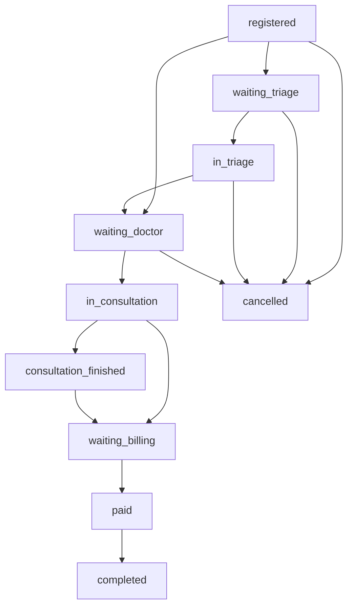

# Máquina de estados de visita

La visita/admisión (`PatientVisit`) es el eje operativo de una atención diaria.

## Estados

| Estado | Significado | Rol que normalmente lo provoca |
| --- | --- | --- |
| `registered` | Visita registrada. | Recepción |
| `waiting_triage` | Esperando triaje. | Recepción |
| `in_triage` | Enfermería está evaluando. | Enfermería |
| `waiting_doctor` | Listo para médico. | Enfermería o recepción |
| `in_consultation` | Consulta iniciada. | Médico |
| `consultation_finished` | Consulta terminada sin pasar aún a caja. | Médico |
| `waiting_billing` | Pendiente de cobro/facturación. | Médico o recepción |
| `waiting_payment` | Pendiente de pago. | Caja |
| `paid` | Factura pagada. | Caja |
| `completed` | Atención cerrada. | Caja/recepción |
| `cancelled` | Atención cancelada. | Recepción/admin |
| `no_show` | Paciente no asistió. | Recepción |

## Transiciones principales

## Validaciones

- `start_consultation` solo desde `waiting_doctor` o `in_consultation`.
- `complete_triage` requiere signos vitales.
- `register_payment` requiere factura.
- `complete_visit` bloquea cierre si hay factura pendiente cuando la clínica exige pago.
- No se reutilizan visitas activas de una misma cita.
